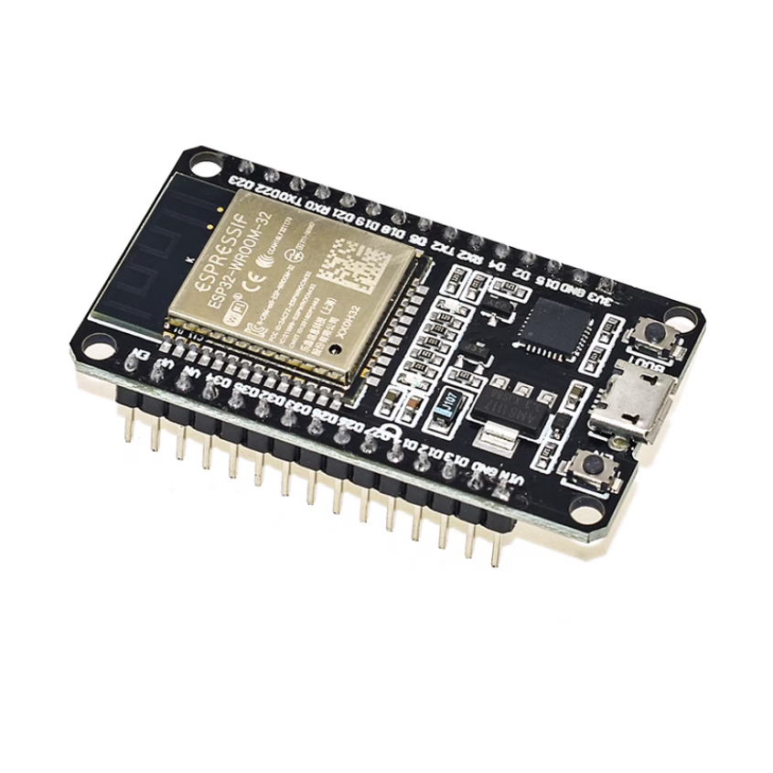

# ESP32 Web控制智能舵机开关

这是一个基于ESP32的智能物理开关模拟项目，通过Web服务器控制一个SG90舵机。用户可以通过网页界面远程控制舵机，实现开/关灯、手动调整角度、设置自动复位等功能，并支持WiFi网络配置。

## 项目概览

*   **项目名称：** ESP32 Web控制智能舵机开关
*   **核心功能：** 通过网页界面远程控制连接在ESP32上的SG90舵机，实现对物理开关的模拟操作，并提供网络配置功能。
*   **开发环境：** Visual Studio Code + PlatformIO插件
*   **开发板型号：** ESP32 DEVKIT V1 (DOIT)
*   

## 硬件连接

*   **舵机型号：** SG90 (旋转范围 0-180度)
*   **舵机信号线 (Signal Pin)：** 连接到ESP32的 **GPIO 13**。

## 软件结构

项目代码分为以下几个主要部分：

1.  **`platformio.ini`**: PlatformIO项目配置文件，定义了开发板型号、框架和所需的库。
2.  **`src/main.cpp`**: ESP32的固件代码，包含Web服务器逻辑、舵机控制、WiFiManager配置和所有功能模块的后端处理。
3.  **`data/index.html`**: Web界面的HTML结构，定义了用户界面的布局和元素。
4.  **`data/style.css`**: Web界面的CSS样式，负责页面的美观和响应式布局。
5.  **`data/script.js`**: Web界面的JavaScript代码，处理前端交互逻辑，通过AJAX请求与ESP32后端通信。

## 功能模块

### 1. 灯具开关 (Light Switch)

*   **功能：** 提供“开灯”和“关灯”两个独立按钮，分别控制灯光的开启和关闭。
*   **舵机动作：**
    *   “开灯”按钮：舵机旋转到“设置开关灯角度”模块中设定的开灯角度。
    *   “关灯”按钮：舵机旋转到“设置开关灯角度”模块中设定的关灯角度。
*   **受自动复位影响：** 最终行为会根据“自动复位控制”模块的设置而定。

### 2. 设置开关灯角度 (Set Light Switch Angles)

*   **功能：** 允许用户分别设置开灯和关灯时舵机应旋转到的具体角度（0-180度）。
*   **UI元素：** 两个独立的数字输入框，分别用于“开灯角度”和“关灯角度”，以及对应的设置按钮。
*   **校验：** 前端和后端都对输入角度进行校验。

### 3. 自动复位控制 (Auto-Reset Control)

*   **功能：** 控制舵机在执行“灯具开关”模块的开/关灯动作后是否自动复位到预设角度。
*   **UI元素：** 一个复选框用于启用/禁用自动复位，一个数字输入框用于设置复位角度。
*   **逻辑：**
    *   **启用时：** 在执行“灯具开关”模块的开/关灯动作（即舵机旋转到设定的开灯或关灯角度）后，等待一小段时间（例如500毫秒），然后舵机自动旋转到“复位位置”输入框中设定的角度。
    *   **禁用时：** 在执行“灯具开关”模块的开/关灯动作后，舵机将保持在设定的开灯或关灯位置，直到接收到新的指令。

### 4. 网络配置 (Network Configuration)

*   **实现：** 使用 `WiFiManager` 库和NTP客户端进行时间同步。
*   **功能：**
    *   **WiFi管理：**
        *   ESP32首次启动或无法连接到已知WiFi时，自动进入AP模式。
        *   用户连接到AP后，通过强制门户配置家庭WiFi。
        *   配置成功后，WiFi凭据将保存到NVS，ESP32自动连接。
        *   网页上显示ESP32的当前IP地址。
        *   新增“退出WiFi”按钮：点击此按钮后，ESP32将断开当前WiFi连接，清除保存的WiFi凭据，并重新进入配网模式（AP模式），方便用户重新配置网络。
    *   **时间信息显示：**
        *   **当前运行时间：** 网页上实时显示ESP32自启动以来的运行时间，精确到秒，格式为 `HH:MM:SS`。
        *   **开机时间：** 网页上显示ESP32通过NTP服务同步到的实际开机日期和时间，格式为 `YYYY-MM-DD HH:MM:SS`。如果NTP同步失败，将显示“NTP未同步”。

## 如何使用

1. **安装PlatformIO：** 在VS Code中安装PlatformIO IDE扩展。

2. **打开项目：** 在VS Code中打开此项目文件夹。

3. **上传文件系统：** 在PlatformIO侧边栏中，找到“PlatformIO: Upload File System Image”任务并运行，将`data`文件夹中的HTML、CSS、JS文件上传到ESP32的SPIFFS文件系统。

4. **编译与上传固件：** 在PlatformIO侧边栏中，找到“PlatformIO: Upload”任务并运行，将`main.cpp`编译并上传到ESP32。

5. **连接WiFi：**
   
   *   首次启动时，ESP32会创建一个名为 `ESP32_SmartSwitch_AP` 的WiFi热点。
   *   使用手机或电脑连接到此热点，会自动弹出配置页面（或手动访问 `192.168.4.1`）。
   *   选择您的家庭WiFi并输入密码进行连接。
   
6. **访问Web界面：** 连接成功后，ESP32会在串口输出其IP地址。在浏览器中输入该IP地址即可访问控制界面。

   

## 注意事项

*   本项目使用同步 `WebServer` 库，而非异步Web服务器。在处理高并发请求时，性能可能受限。
*   `main.cpp` 中的 `delay(500)` 会阻塞Web服务器，在实际生产环境中，建议使用非阻塞的定时器或FreeRTOS任务来处理自动复位延迟。
